# Hubaix - AI-Powered Software Solutions 💡🚀

## 🌍 Your Partner in Intelligent Software Solutions

Hubaix is an advanced **AI-driven software solutions** platform built with **Next.js**, providing cutting-edge AI/ML services, web and mobile app development, and remote hiring solutions. Designed with high performance and **mobile responsiveness**, Hubaix ensures a seamless experience across all devices.

---

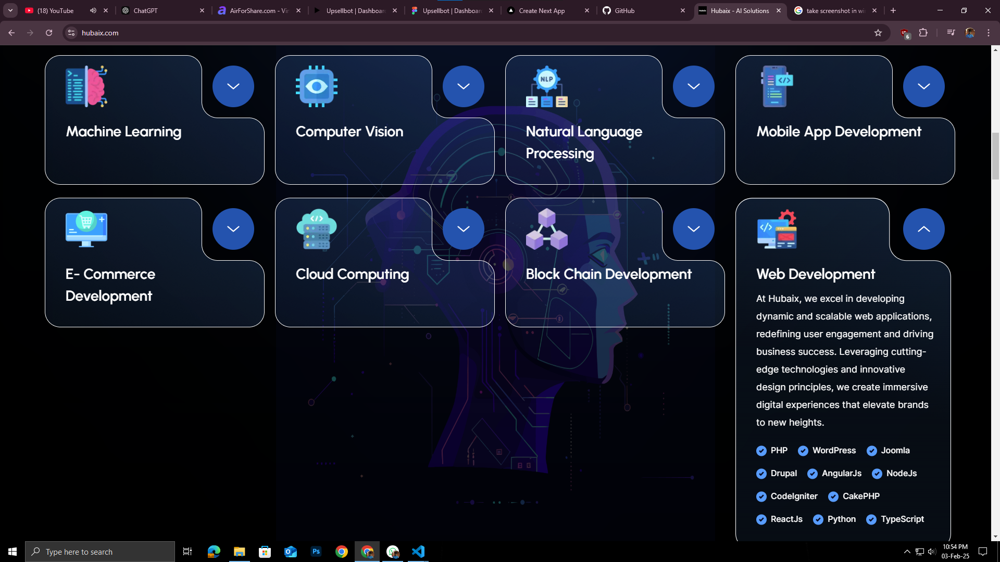
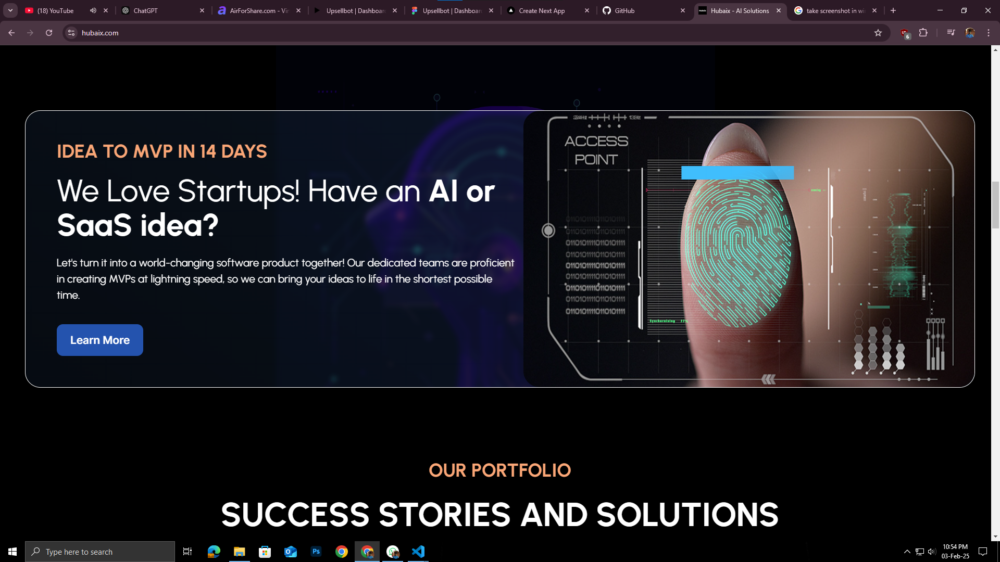

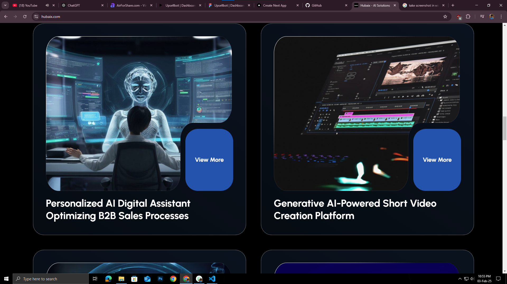
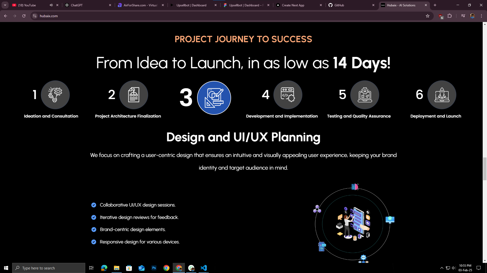
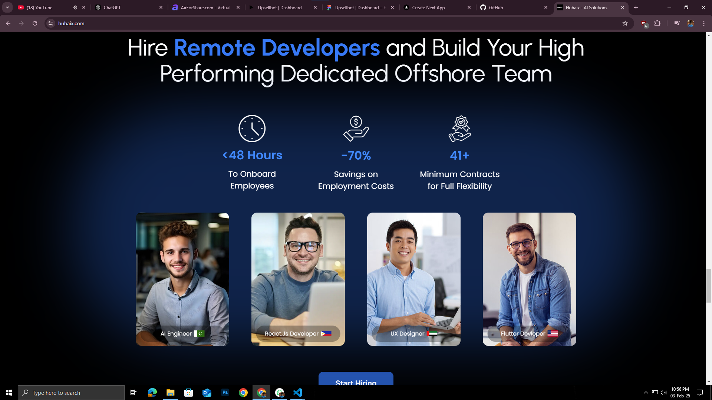
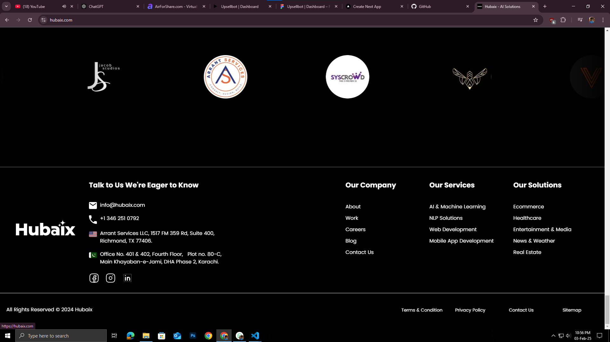
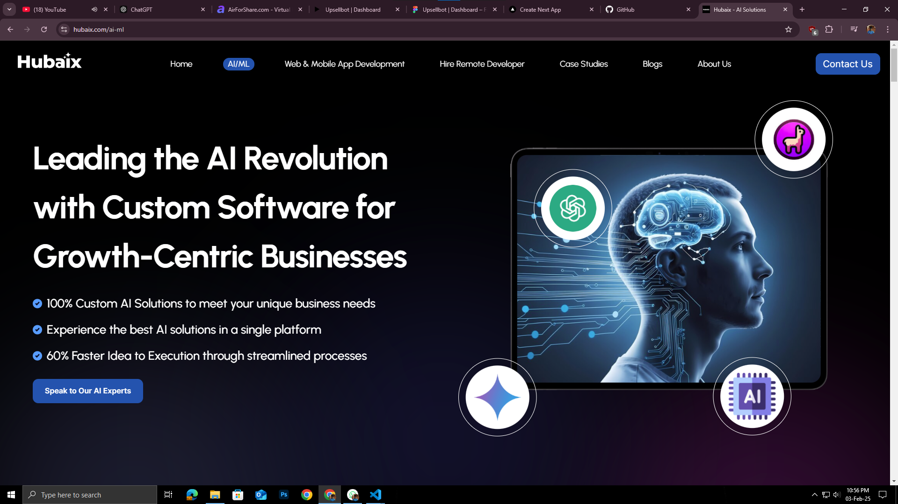
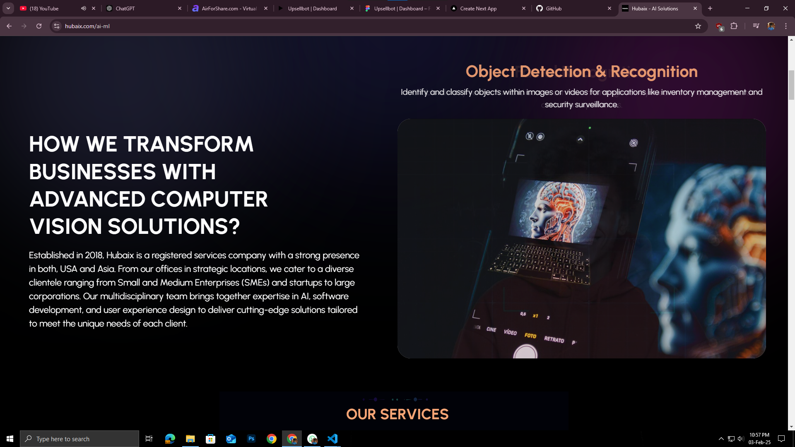
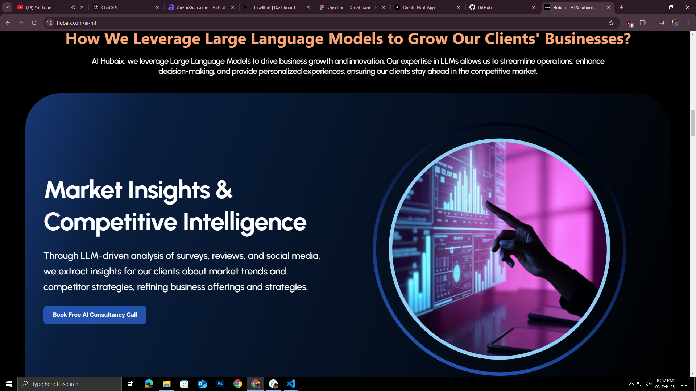
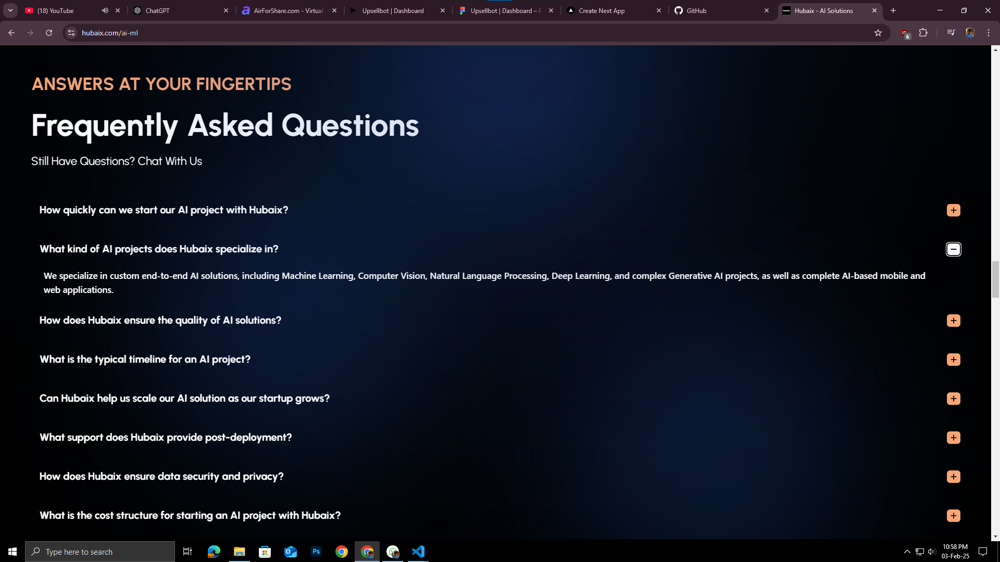
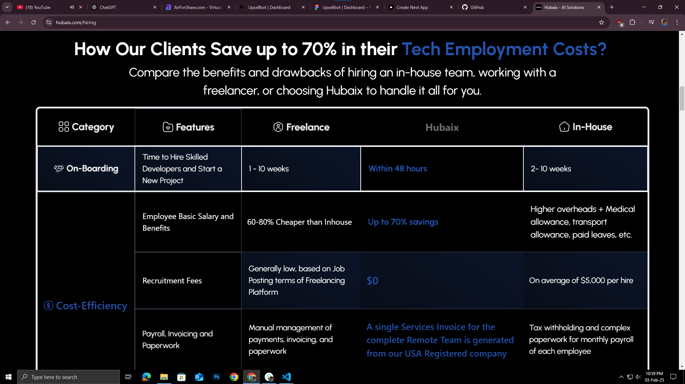
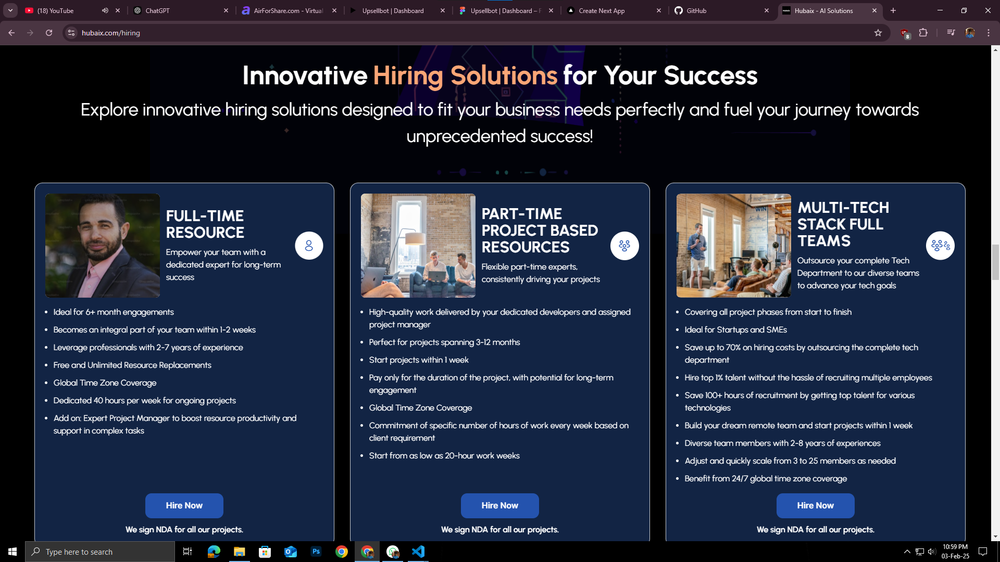
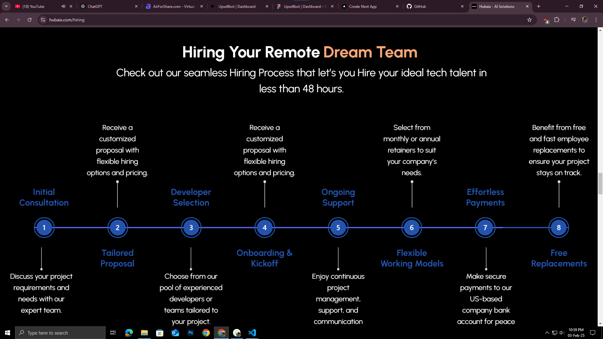
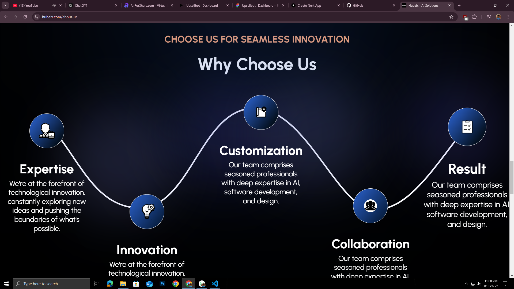
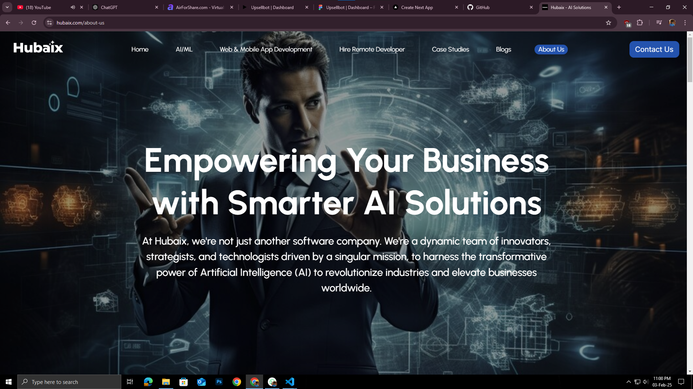
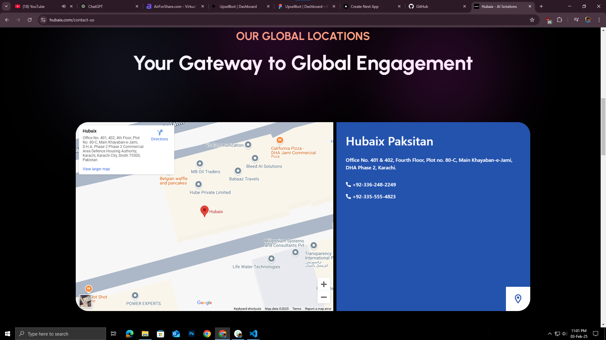

---

## 🔥 Core Features

- **AI & ML Solutions** 🤖

  - Custom AI development, LLM-powered insights, NLP solutions
  - Machine learning and deep learning model implementations
  - AI-driven automation for businesses

- **Web & Mobile App Development** 📱💻

  - Scalable and secure web applications using Next.js, React.js, and Node.js
  - Cross-platform mobile applications with React Native & Flutter
  - Optimized UI/UX for seamless user engagement

- **Hire Remote Developers** 🌎

  - Full-time, part-time, and project-based hiring
  - Experts in various technologies with flexible engagement models
  - AI-driven hiring process to find the right talent

- **Case Studies & Portfolio** 📑

  - Showcasing real-world AI implementations and digital transformations
  - AI-powered chatbots, compliance solutions, and LLM-based market research

## 🏗️ Tech Stack & Architecture

| Tech Stack      | Purpose                    |
| --------------- | -------------------------- |
| **Next.js**     | Frontend Framework         |
| **React.js**    | Component-based UI         |
| **Node.js**     | Backend Services           |
| **MongoDB**     | NoSQL Database             |
| **LangChain**   | LLM & AI Model Integration |
| **OpenAI API**  | AI & GPT-powered features  |
| **FAISS**       | Vector Database for AI     |
| **TailwindCSS** | Modern UI Styling          |

Hubaix ensures a **serverless-first** approach, leveraging **cloud-based AI pipelines** to ensure scalability and efficiency.

## 📱 Mobile Responsiveness

Hubaix is built with a **fully responsive UI**, ensuring a seamless experience across **mobile, tablet, and desktop**. The design is optimized using **TailwindCSS** and **adaptive layouts**.

## 🔐 Security & Compliance

Security is a top priority. Hubaix follows:

- ✅ **GDPR & HIPAA Compliance**
- ✅ **Secure API Authentication** (JWT-based auth)
- ✅ **End-to-End Encryption** for user data
- ✅ **Role-Based Access Control**

## 🚀 Deployment & Hosting

Hubaix is deployed on a **cloud-native infrastructure** with:

- **Vercel** for frontend hosting
- **AWS Lambda** for serverless backend services
- **MongoDB Atlas** for high-availability database
- **Cloudflare** for CDN & security optimizations

## 📊 Business Impact

Hubaix empowers businesses by:

- 🔹 **70% faster AI solution deployment**
- 🔹 **60% cost savings in software development**
- 🔹 **24/7 operational support & maintenance**

## 📞 Contact Us

For inquiries, reach out:
📧 Email: [info@hubaix.com](mailto\:info@hubaix.com)\
🌍 Website: [www.hubaix.com](https://hubaix.com)\
🏢 Office: **USA & Pakistan Headquarters**

---

© 2025 Hubaix. All Rights Reserved. 🚀